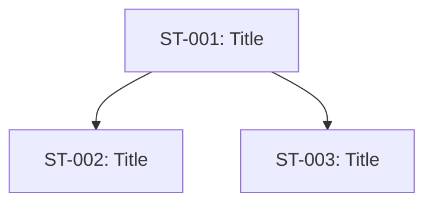

# Story Breakdown Template

## Feature Summary

- Feature ID:
- Feature name:
- Feature owner:

## Epic Structure

### Epic 1: [Name]

**Goal:** 

**Acceptance Criteria:**
- 

#### Story ST-001: [Title]

**As a** [role]  
**I want** [capability]  
**So that** [benefit]

**Acceptance Criteria:**
- [ ] AC1:
- [ ] AC2:

**Tasks:**
- Task 1.1:
- Task 1.2:

**Estimate:** [hours or story points]  
**Priority:** High / Medium / Low  
**Dependencies:** [other stories or "None"]

---

#### Story ST-002: [Title]

**As a** [role]  
**I want** [capability]  
**So that** [benefit]

**Acceptance Criteria:**
- [ ] AC1:

**Tasks:**
- Task 2.1:

**Estimate:**  
**Priority:**  
**Dependencies:**

---

### Epic 2: [Name]

(Repeat structure)

---

## Story Sequencing

## Risks and Blockers

| Story | Risk | Mitigation |
|---|---|---|
| ST-001 |  |  |

## Open Gaps

- GAP-001:
