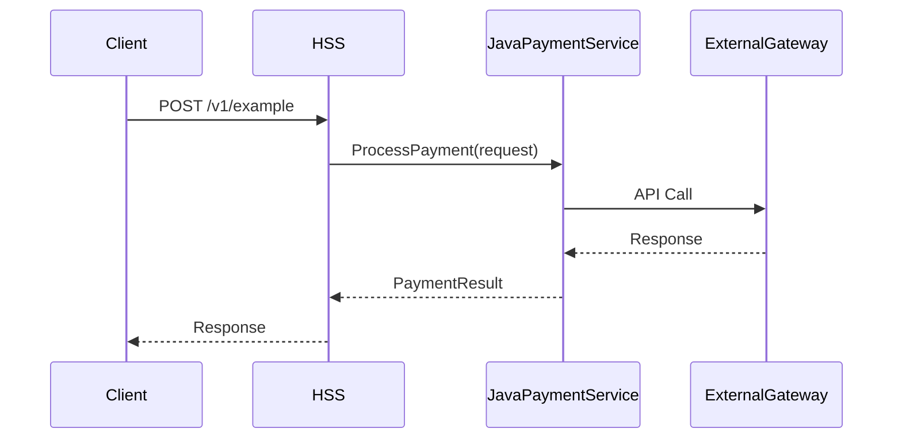

# Data Flows — FEAXXXX <Feature Name>

## Flow Diagram

<!-- Provide a Mermaid sequence diagram showing the primary data/API flow.
     Include all involved services and external systems. -->

## Step-by-Step Description

<!-- Number each step to match the diagram above. Be specific about endpoints, payloads, and transformations. -->

1. **Client → HSS:** `POST /v1/example` — description of request payload and trigger condition.
2. **HSS → JavaPaymentService:** Description of internal call, data transformed/passed.
3. **JavaPaymentService → External Gateway:** Description of external API call.
4. **Response path:** Description of how results flow back.

## Error / Exception Flows

<!-- Describe what happens when each step fails. -->

| Step | Failure Scenario | Handling |
|---|---|---|
| Step 2 | JavaPaymentService unavailable | <!-- e.g., HSS returns 503, retry not attempted --> |
| Step 3 | Gateway timeout | <!-- e.g., JavaPaymentService retries 2x then marks transaction failed --> |

## Alternate Flows

<!-- List any secondary flows (e.g., void, refund, rollback). Add diagrams as needed. -->
