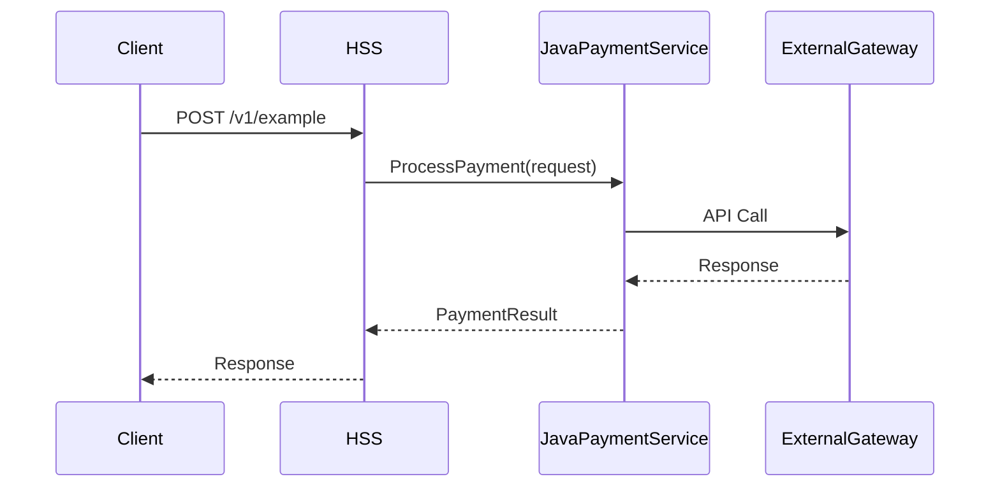

# AD2_FEAXXXX — <Feature Name>

← Requirements: [Requirements_FEAXXXXX.md](../Requirements/Requirements_FEAXXXXX.md)

---

## Overview

### Feature Summary

<!-- 2–3 sentences: what the feature does, who it serves, and the core value it delivers. -->

### Architectural Approach

<!-- Describe the pattern or strategy chosen and why.
     Reference ADR files for any significant decisions. -->

### Involved Domain Teams

<!-- List only teams this feature actually requires. -->

| Team | Role in this Feature |
|---|---|
| <!-- e.g., JavaPaymentService --> | <!-- e.g., Implements Adyen gateway adapter --> |

### Key Design Decisions

| Decision | Approach Chosen | ADR |
|---|---|---|
| <!-- e.g., Payment session model --> | <!-- e.g., Sessions API --> | [ADR_FEAXXX_...](../ADR/) |

### Requirements Traceability

| REQ | Description | Section / Task |
|---|---|---|
| REQ-001 | | |

---

## Data Flows

### Flow Diagram



### Step-by-Step Description

1. **Client → HSS:** `POST /v1/example` — description of request and trigger.
2. **HSS → JavaPaymentService:** Description of internal call and data passed.
3. **JavaPaymentService → External Gateway:** External API call details.
4. **Response path:** How results flow back.

### Error / Exception Flows

| Step | Failure Scenario | Handling |
|---|---|---|
| Step 2 | Service unavailable | |
| Step 3 | Gateway timeout | |

### Alternate Flows

<!-- Describe secondary flows (void, refund, rollback, etc.) -->

---

## Security

### Authentication & Authorization Model

<!-- How are requests authenticated and authorized for this feature? -->

### PCI / Regulatory Scope

| Item | In Scope? | Notes |
|---|---|---|
| Card data transmitted | | |
| Card data stored | | |
| PCI-DSS controls required | | |

### Data Sensitivity Classification

| Data Element | Classification | Storage / Transmission |
|---|---|---|
| | | |

### Threat Model Highlights

| Threat | Mitigation |
|---|---|
| | |

### Security Tasks

| Task | Team | Description |
|---|---|---|
| | JavaSecurityService | |

---

## Database

### Overview

<!-- Brief description of schema changes required. -->

### New Tables

<!-- ### `<table_name>`

| Column | Type | Constraints | Description |
|---|---|---|---|
| `id` | `INT` | `PK, NOT NULL, IDENTITY` | Primary key |
-->

### Modified Tables

<!-- ### `<existing_table_name>`

**Additions:**

| Column | Type | Constraints | Description |
|---|---|---|---|
-->

### Migration Script

```sql
-- Migration: FEAXXXX_<FeatureName>

BEGIN TRANSACTION;

-- Add migration SQL here

COMMIT;
```

### Rollback Script

```sql
-- Rollback: FEAXXXX_<FeatureName>

BEGIN TRANSACTION;

-- Add rollback SQL here

COMMIT;
```

---

## Domain Team: <TeamName>

→ *[Full implementation detail, pseudocode, and code references](AD2_FEAXXXX_DomainTeam_<TeamName>.md) — generated by `/archon split`*

### Overview

<!-- What is this team responsible for in this feature? -->

### Tech Tasks

| Task | Description |
|---|---|
| **1.1** | <!-- Short, atomic description — e.g., "Add POST /v2/payments/adyen/checkout to PaymentsController" --> |
| **1.2** | |

---

## QA

### Test Strategy

| Layer | Approach | Owner |
|---|---|---|
| Unit | | Dev teams |
| Integration | | Dev teams |
| E2E | | QA team |

### Key Test Scenarios

#### Happy Path

| # | Scenario | Expected Result |
|---|---|---|
| 1 | | |

#### Edge Cases & Error Paths

| # | Scenario | Expected Result |
|---|---|---|
| 1 | | |

#### Security Scenarios

| # | Scenario | Expected Result |
|---|---|---|
| 1 | | |

### Test Data Requirements

- <!-- e.g., Test property with PMS connected in staging -->

### Environment Dependencies

| Dependency | Environment | Notes |
|---|---|---|
| | Staging | |

---

## Estimates

> Estimates are in **hours**. Refine with each team before sprint planning.

| Domain Team | Tasks | Estimate (hrs) |
|---|---|---|
| <!-- e.g., JavaPaymentService --> | <!-- e.g., 1.1, 1.2, 1.3 --> | |
| **Total** | | |

---

## Open GAPs

<!-- Propagated from Requirement_GAPS.md. Use [GAP-XXX: OPEN] markers inline above and list here. -->

| ID | Title | Status |
|---|---|---|
| [GAP-001](../Requirements/Requirement_GAPS.md#gap-001) | | OPEN |
