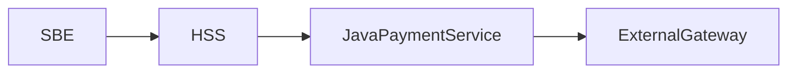

# Overview — FEAXXXX <Feature Name>

## Feature Summary

<!-- 2–3 sentences: what the feature does, who it serves, and the core value it delivers. -->

## Architectural Approach

<!-- Describe the pattern or strategy chosen (e.g., event-driven, REST API extension, gateway integration).
     Explain why this approach was selected over alternatives.
     Reference any ADRs that capture key decisions. -->

## System Context

<!-- List or diagram the components involved.
     Use a Mermaid diagram if helpful:

-->

### Components Involved

| Component | Role in this Feature |
|---|---|
| <!-- e.g., HSS --> | <!-- e.g., Orchestrates booking and delegates payment --> |

## Key Design Decisions

<!-- Reference ADR files for each significant decision made. -->

| Decision | Approach Chosen | ADR |
|---|---|---|
| <!-- e.g., Payment session model --> | <!-- e.g., Sessions API (not Checkout API) --> | [ADR_FEAXXX_...](../ADR/) |

## Cross-Cutting Concerns

### Security Model
<!-- Brief description. Full detail in AD2_FEAXXXX_Security.md -->

### Data Flow Summary
<!-- Brief description. Full detail in AD2_FEAXXXX_DataFlows.md -->

### Database Impact
<!-- Brief description. Full detail in AD2_FEAXXXX_Database.md -->
